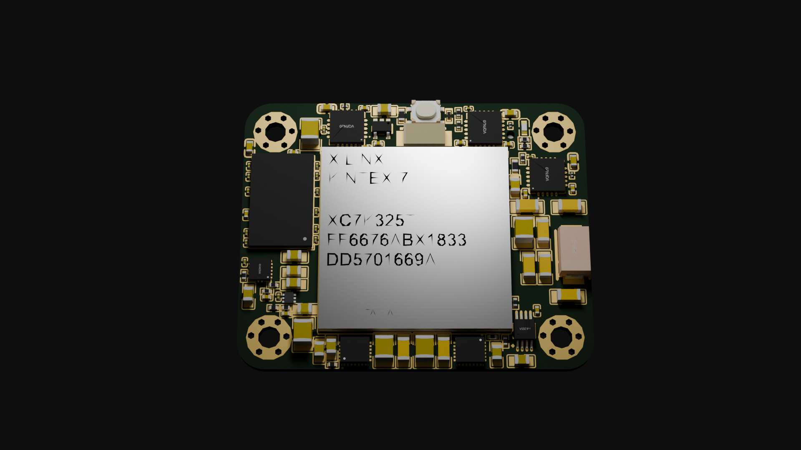

# RadiaX

**Open-source, desktop micro-CT project built from scratch by two students.**

RadiaX combines custom X-ray hardware, embedded computing, FPGA acceleration, a custom X-ray detector, and modular precision mechanics into a research-oriented CT platform.

<p align="center">

</p>

> **Built fully from scratch.** 

RadiaX is a **Hack Club Stardance project**, developed as an open-source engineering project.

### The includet Files are not cleaned up or finished

## Repository

The repository is organized around the different engineering areas of the project:

```text
RadiaX/
├── cad/             # CAD models, assemblies and mechanical design
├── electronics/     # PCBs, schematics and electronic hardware
├── prototyping/     # Experimental hardware and detector prototypes
└── ...
```

## Hardware

### Computing & FPGA Platform

RadiaX uses a custom **Rockchip RK3566** computing platform for scanner control, data handling and the software stack.

The 8-layer custom PCB integrates **LPDDR4, eMMC, PCIe, USB 3.x, HDMI, MIPI-DSI, Gigabit Ethernet and custom power monitoring**.

<p align="center">
  
</p>

A separate **Kintex-7 FPGA platform** is currently in development for high-speed detector acquisition, signal processing and hardware-accelerated reconstruction.

The FPGA architecture is intended to support future **AI acceleration and hardware/software co-processing**.

<p align="center">
  <strong>FPGA SOM — sneak peek</strong><br>
  
</p>

### X-ray System

RadiaX uses a custom **dual-tube X-ray architecture** designed for different imaging needs.

The tube enclosure incorporates **high-voltage isolation and mineral-oil cooling**, combining dielectric insulation with passive thermal management.

<p align="center">
  
</p>

A **monoblock magnetic filter** is being developed to reduce  low-energy X-rays.

### Custom X-ray Detector

A custom **scintillator-based CIS detector** is being developed specifically for RadiaX.

The current detector is a **prototype** combining a CIS imaging sensor, scintillator and optical/mechanical integration to validate the detector concept and imaging geometry. You can see it on the left side !

<p align="center">
  
</p>

### Modular Mechanics

The scanner uses a modular mechanical architecture designed specifically around the CT geometry.

The Mark 2 mechanical system incorporates:

* **3-axis kinematic object positioning**
* Motorized rotational and linear positioning
* Custom X-ray head and detector mounts
* Modular aluminum extrusion and panel construction
* Custom structural components and interfaces
* Direct drivetrain coupling for the rotational system

Structural design is supported by **component-level, static and dynamic FEA**, including stress, deflection and modal analysis.

Natural-frequency simulations are used to investigate structural resonance and vibration from the motion system during long rotational scans.

Mass-center and load-distribution analysis is also used to maintain stable weight distribution across the rotating and stationary structures.

## AI & Reconstruction

RadiaX is being designed around a **hardware-accelerated reconstruction pipeline**.

The future FPGA platform is intended to accelerate computationally intensive parts of the imaging pipeline, with **AI-based image processing and reconstruction** planned alongside conventional reconstruction methods.

## Supported By

RadiaX has received support from **Radiacode**, contributing radiation-detection technology to the project.

[Radiacode](https://radiacode.com/)

## Project Status

RadiaX is actively under development.

| Subsystem                 | Status                 |
| ------------------------- | ---------------------- |
| RK3566 computing platform | Prototype              |
| X-ray system              | Prototype              |
| Dual-tube architecture    | Prototype              |
| Custom detector concept   | Nearly complete        |
| CIS detector              | Rough proof-of-concept |
| Larger CIS scanner        | In development         |
| Kintex-7 FPGA platform    | In development         |
| Modular mechanical system | REV. 2                 |
| FEA & structural analysis | Active                 |
| AI / reconstruction       | In development         |

Design files, measurements and technical documentation will be published as they are cleaned up and finalized.

---

## Built by

**Luka & Marco**

Two students developing the complete platform together.

I kept the existing wording otherwise unchanged.
