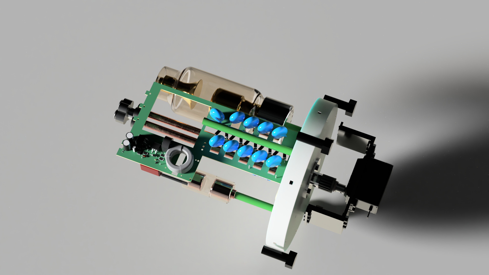

# RadiaX

**Open-source desktop micro-CT platform built from scratch by two students.**

RadiaX combines custom X-ray hardware, FPGA acceleration, embedded computing, a custom X-ray detector, and modular precision mechanics into a single research-oriented CT platform.

> **Built from scratch.** Custom electronics, X-ray system, detector, mechanics, FPGA platform, software and reconstruction pipeline.

## Hardware

### Custom Hardware Platform

RadiaX is built around custom hardware rather than development-board assemblies.

The platform combines a **Kintex-7 FPGA system** for high-speed acquisition and processing with a custom **Rockchip RK3566** ARM computer for system control, data handling and the software stack.

The RK3566 computer is an 8-layer custom PCB designed specifically for RadiaX, including LPDDR4, eMMC, PCIe, USB 3.x, HDMI, MIPI-DSI, Gigabit Ethernet and custom power monitoring.

The FPGA platform provides the hardware foundation for high-speed detector acquisition, signal processing and future **AI-accelerated reconstruction and image processing**.

### X-ray System

RadiaX uses a custom **dual-tube X-ray architecture** designed to support different imaging requirements.

The X-ray head and its supporting electronics are developed in-house, including high-voltage generation, filament power, control electronics and the internal mechanical structure.

### Custom X-ray Detector

A custom scintillator-based X-ray detector is being developed specifically for RadiaX.

The detector combines custom **CIS/CMOS imaging circuitry**, scintillator optics and mechanical integration rather than relying on a conventional commercial CT detector.

A larger custom CIS-based scanner and detector electronics are currently under development.

### Modular Mechanics

The mechanical system is designed around the CT geometry and developed as a modular platform.

It includes custom structural components, motion systems, X-ray head integration and precision detector positioning.

**Custom FEA simulations** are used to validate mechanical structures and guide the design before fabrication.

## AI & Reconstruction

RadiaX is being designed with hardware-accelerated reconstruction and image processing in mind.

The FPGA platform provides a foundation for future **custom reconstruction pipelines, AI acceleration and hardware/software co-processing**.

The goal is to move computationally intensive parts of the CT pipeline closer to the acquisition hardware rather than treating the FPGA as only a data interface.

## Supported By

RadiaX has received support from **Radiacode**, whose radiation-detection technology and expertise have contributed to the project's development.

[Radiacode](https://radiacode.com/)

## Project Status

RadiaX is actively under development.

The FPGA platform, embedded computer, X-ray system, custom detector, software, AI/reconstruction pipeline and mechanical systems are being developed in parallel.

Design files, measurements and technical documentation will be published as they are cleaned up and finalized.

---

## Built by

**Luka & Marco**

Two students building the complete system from the hardware and X-ray electronics to the detector, FPGA, software and custom mechanics.
